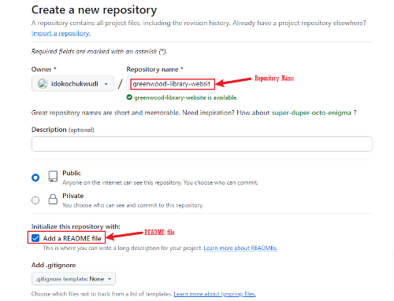
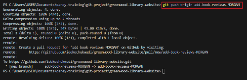
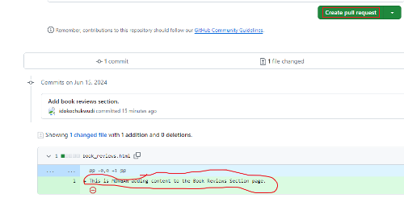
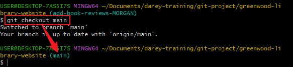

# greenwood-library-website

This Capstone project is a demonstration of my proficiency in Git version control and the collaborative skills I have honed throughout the course. By leveraging a suite of powerful tools, I aimed to create a comprehensive and practical project.

#### Tools Utilized:
- **Git:** For version control and managing project history.
- **GitHub:** For hosting the repository and facilitating collaboration.
- **Visual Studio Code:** As the integrated development environment for writing and editing code.
- **Markdown:** For creating structured and readable documentation.
- **Snipaste:** For capturing and annotating screenshots.

#### Objectives:
1. **Repository Cloning and Branch Management:** Practice the process of cloning repositories and effectively managing branches in Git.
2. **Experience with Staging, Committing, and Pushing Changes:** Gain hands-on experience in staging, committing, and pushing changes from multiple developers.
3. **Pull Requests and Conflict Resolution:** Create pull requests, handle potential merge conflicts, and successfully merge changes.

The following snapshots provide a visual representation of the commands used to accomplish these tasks, offering insight into the practical application of the tools and techniques involved.

#### Setup:
1. Create a Repository on GitHub, name it **greenwood-library-website** and initialize it with a **README.md** file

2. Clone it to your local machine **STEP 1**

3. Clone it to your local machine **STEP 2**

#### Tasks:
1. In the main branch, using Visual Studio Code editor ensure there are files for each of the web pages.
- home.html
- about_us.html
- events.html
- contact_us.html

2. Add any random content into each of the files.

3. Status before staging

4. Stage Changes

5. Commit Changes

6. Push Changes

#### Morgan's Work: Adding Book Reviews
1. Create a Branch for Morgan, add a new file **book_reviews.html** to represent the Book Reviews Section and add a random text content into the file.

2. Stage Changes for **book-reviews**

3. Commit Changes for **book-reviews**

4. Push the **add-book-reviews** branch to GitHub.

5. Raise a PR for Morgan's work

6. Open Pull Request for Morgan

7. Create Pull Request for Morgan

8. Merge Morgan's work to the **main** branch

#### Jamie's Work: Updating Events Page

1. Switch back to **main**

2. Pull the latest changes from GitHub.

3. Create a branch for Jamie

4. Jamie with latest changes

5. Jamie Update event page

6. Stage Jamie's work

7. Commit Jamie's work

8. Push the Jamie's update-events

9. Raise PR for Jamie's work **Stept 1**

Raise PR for Jamie's work **Stept 2**

Raise PR for Jamie's work **Stept 3**

Raise PR for Jamie's work **Stept 4**

#### Added Task: ZIVA to Create image folder for documentation
1. Create a Branch for ZIVA

2. ZIVA Create image folder

3. Stage changes made by ZIVA

4. Commit changes made by ZIVA

5. Push the add-imagesZIVA branch to GitHub

6. Raise a PR for Ziva's work **Step 1**

Raise a PR for Ziva's work **Step 2**

Raise a PR for Ziva's work **Step 3**

Raise a PR for Ziva's work **Step 4**

Image folder merged with the origin document

### Conclusion
This Capstone project effectively demonstrates my mastery of Git version control and my ability to collaborate efficiently in a development environment. By utilizing essential tools like Git, GitHub, Visual Studio Code, Markdown, and Snipaste, I was able to create a project that embodies the practical application of the skills acquired throughout the course.

One of the key tasks included the creation of a new branch dedicated to adding an image folder, which was then successfully pushed to the GitHub repository. This task not only highlighted my capability in branch management but also showcased my proficiency in handling repository content organization and version control.

Additionally, I switched to the main branch and successfully added the README.md file, which contains comprehensive documentation for the project, to my GitHub repository. This step further emphasizes my ability to manage and document projects effectively.

Overall, this project serves as a testament to my technical and collaborative skills, laying a solid foundation for future development endeavors. The snapshots included provide a visual representation of the various commands and processes utilized, underscoring the practical execution of the project objectives.

